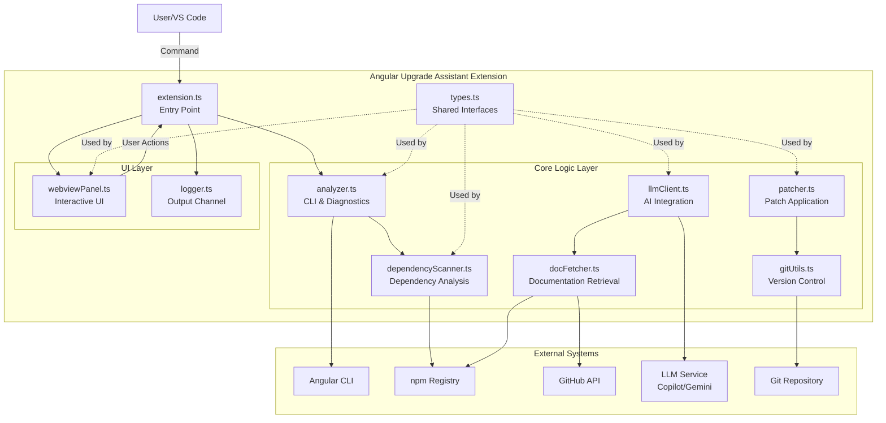
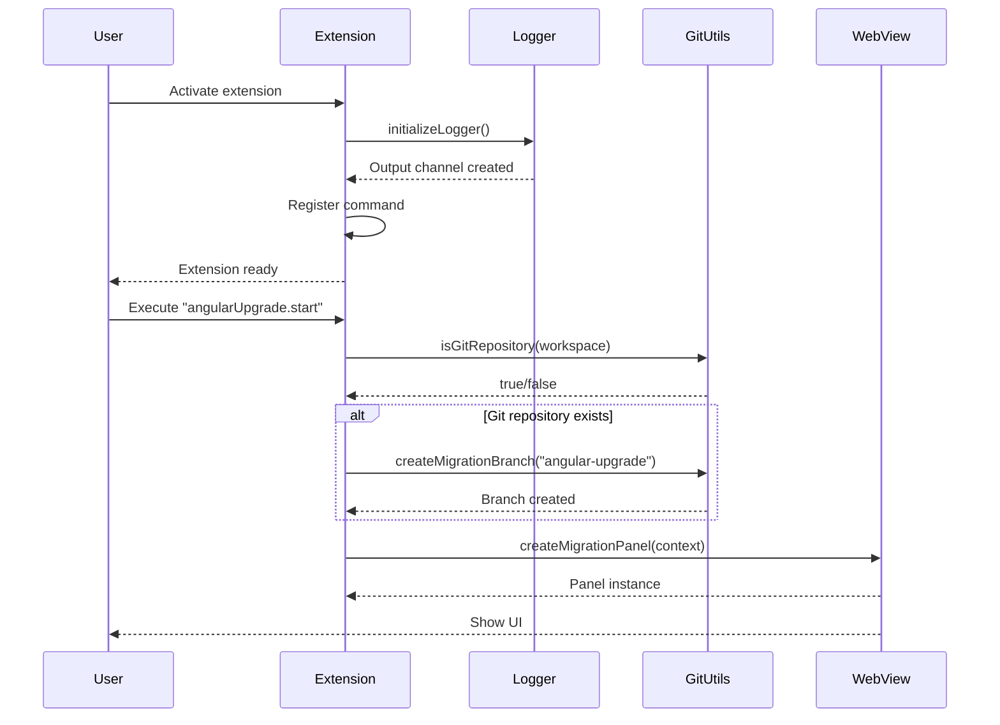
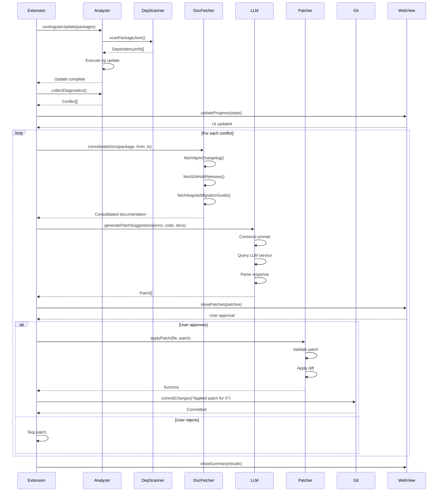
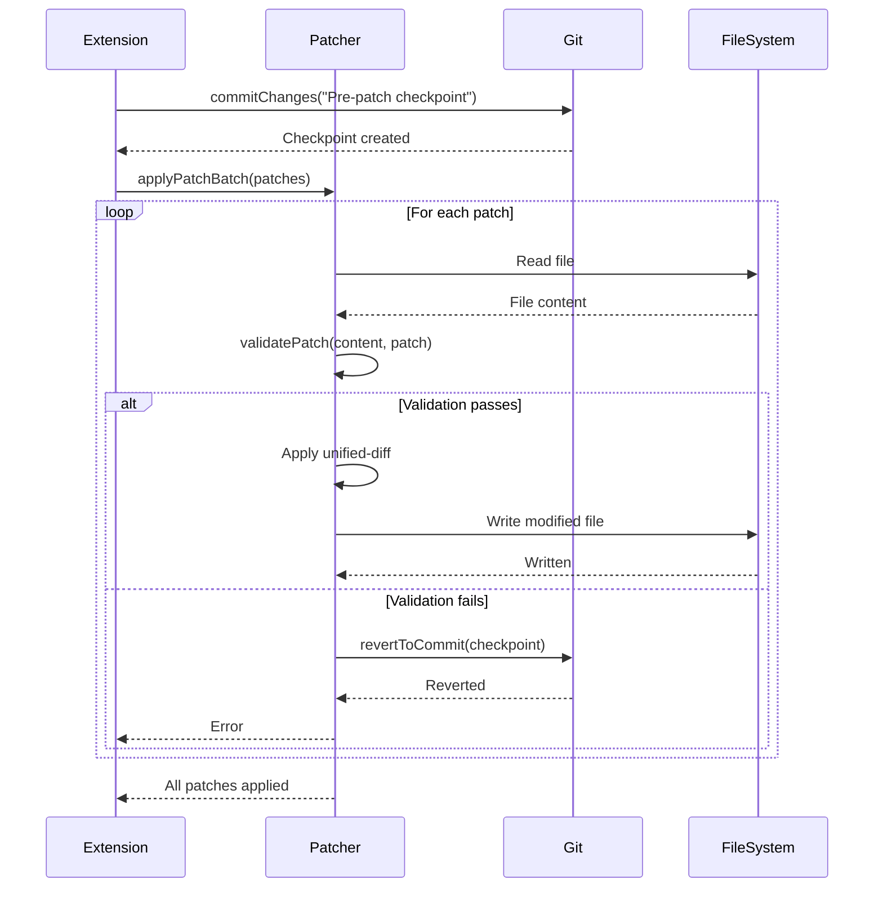
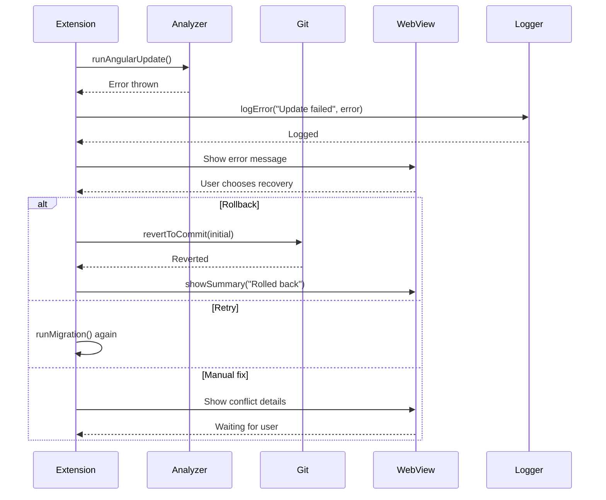
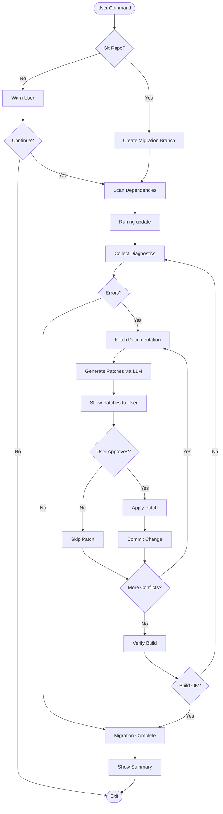
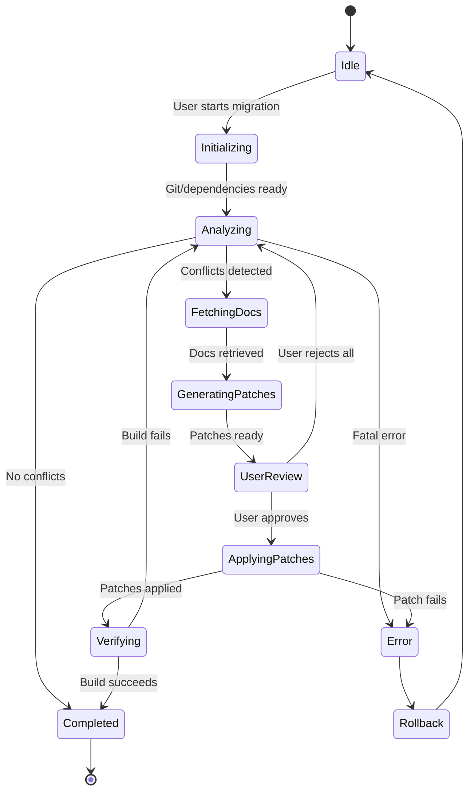
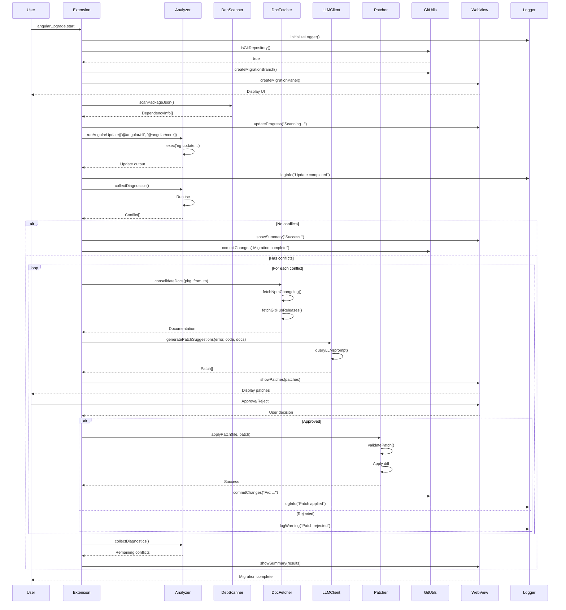
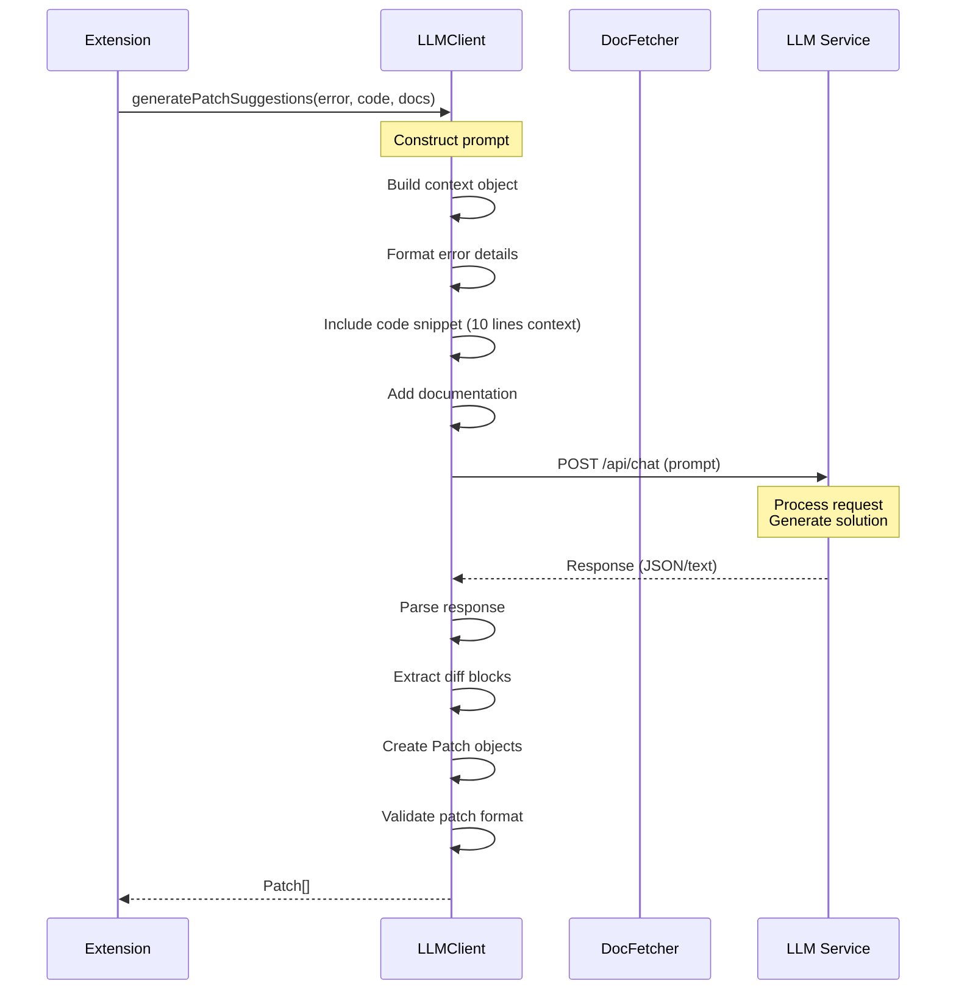
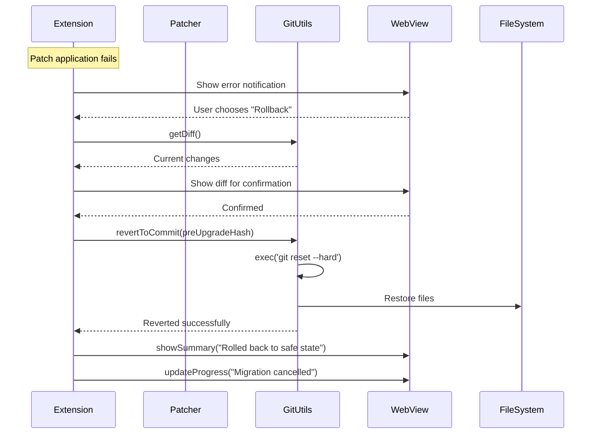

# Angular Upgrade Assistant - Design Document

This document provides comprehensive High-Level Design (HLD) and Low-Level Design (LLD) specifications for the Angular Upgrade Assistant VS Code extension.

---

## Table of Contents

1. [High-Level Design (HLD)](#high-level-design-hld)
2. [Low-Level Design (LLD)](#low-level-design-lld)
3. [Module Interactions](#module-interactions)
4. [Data Flow](#data-flow)
5. [Sequence Diagrams](#sequence-diagrams)

---

## High-Level Design (HLD)

### 1.1 System Overview

The Angular Upgrade Assistant is a VS Code extension that automates the Angular framework upgrade process by intelligently analyzing, patching, and verifying migrations. It integrates with Git for safety, LLMs for intelligent patch generation, and provides a rich WebView UI for user interaction.

### 1.2 Architecture Diagram



### 1.3 Component Responsibilities

| Component | Responsibility |
|-----------|---------------|
| **extension.ts** | Extension lifecycle management, command registration, orchestration |
| **analyzer.ts** | Execute Angular CLI updates, collect TypeScript diagnostics, identify conflicts |
| **dependencyScanner.ts** | Scan package.json and imports, map dependency usage across project |
| **docFetcher.ts** | Retrieve changelogs, migration guides, and breaking change documentation |
| **llmClient.ts** | Interface with LLM providers for intelligent patch generation |
| **patcher.ts** | Apply/revert unified-diff patches, validate patch applicability |
| **gitUtils.ts** | Git operations for safe migration (branching, commits, rollback) |
| **webviewPanel.ts** | Render migration UI, show patches, progress, and summary |
| **logger.ts** | Log migration steps to Output Channel and history file |
| **types.ts** | Define shared data structures and interfaces |

### 1.4 Technology Stack

- **Language**: TypeScript
- **Platform**: VS Code Extension API
- **External Tools**: Angular CLI, Git, npm
- **External Services**: GitHub API, npm Registry, LLM APIs (Copilot/Gemini)
- **UI**: WebView API with HTML/CSS/JavaScript

---

## Low-Level Design (LLD)

### 2.1 Module Interaction Matrix

| From Module | To Module | Purpose | Data Exchanged |
|------------|-----------|---------|----------------|
| extension.ts | analyzer.ts | Initiate upgrade | Package names → Diagnostics |
| extension.ts | webviewPanel.ts | Show UI | Configuration → WebView Panel |
| extension.ts | logger.ts | Initialize logging | - → Output Channel |
| extension.ts | gitUtils.ts | Check Git status | Workspace path → Boolean |
| analyzer.ts | dependencyScanner.ts | Get dependencies | - → DependencyInfo[] |
| analyzer.ts | Angular CLI | Run update | Command → stdout/stderr |
| dependencyScanner.ts | npm Registry | Fetch versions | Package name → Version info |
| docFetcher.ts | npm Registry | Get changelog | Package@version → Changelog text |
| docFetcher.ts | GitHub API | Get releases | Repo + version → Release notes |
| llmClient.ts | docFetcher.ts | Get context docs | Package info → Documentation |
| llmClient.ts | LLM Service | Generate patches | Error + code + docs → Patch[] |
| patcher.ts | File System | Apply patches | Patch + file path → Modified file |
| patcher.ts | gitUtils.ts | Create backup | - → Commit hash |
| webviewPanel.ts | extension.ts | User actions | Button clicks → Commands |
| logger.ts | Output Channel | Write logs | Log messages → Display |

### 2.2 Detailed Class/Module Design

#### 2.2.1 extension.ts

```typescript
// Main orchestrator

Class: ExtensionActivation
├── activate(context: ExtensionContext)
│   ├── Registers command: angularUpgrade.start
│   ├── Initializes logger
│   └── Sets up event handlers
│
└── Command Handler: angularUpgrade.start
    ├── 1. Validate workspace (Git check)
    ├── 2. Create migration branch (gitUtils)
    ├── 3. Show WebView panel (webviewPanel)
    ├── 4. Start migration workflow
    │   ├── a. Run analyzer
    │   ├── b. Scan dependencies
    │   ├── c. Fetch documentation
    │   ├── d. Generate patches (LLM)
    │   ├── e. Apply patches
    │   ├── f. Verify changes
    │   └── g. Commit changes
    └── 5. Show summary
```

**Key Methods**:
- `activate()`: Register commands and initialize services
- `runMigration()`: Main workflow orchestration
- `handleWebviewMessage()`: Process user actions from WebView
- `deactivate()`: Cleanup resources

#### 2.2.2 analyzer.ts

```typescript
// Angular CLI interaction and diagnostics

Methods:
├── runAngularUpdate(packages: string[]): Promise<void>
│   ├── Executes: ng update @angular/cli @angular/core
│   ├── Calls: npm install
│   └── Returns: Command output
│
├── collectDiagnostics(): Promise<Conflict[]>
│   ├── Runs TypeScript compiler
│   ├── Parses compiler errors
│   └── Returns: Array of conflicts with file paths and line numbers
│
└── analyzeBreakingChanges(from: string, to: string): Promise<any[]>
    ├── Compares version differences
    └── Returns: List of breaking changes
```

**Dependencies**: 
- Uses: `dependencyScanner` for package info
- Calls: Angular CLI via child_process
- Returns: `Conflict[]` type from `types.ts`

#### 2.2.3 dependencyScanner.ts

```typescript
// Dependency analysis and mapping

Methods:
├── scanPackageJson(path: string): Promise<DependencyInfo[]>
│   ├── Reads package.json
│   ├── Parses dependencies, devDependencies, peerDependencies
│   └── Returns: Structured dependency list
│
├── scanImports(projectRoot: string): Promise<Map<string, string[]>>
│   ├── Walks file tree
│   ├── Parses import statements
│   └── Returns: Map of package → files using it
│
└── identifyAngularPackages(deps: DependencyInfo[]): DependencyInfo[]
    ├── Filters for @angular/* packages
    └── Returns: Angular-specific dependencies
```

**Data Structures**:
- Input: File paths
- Output: `DependencyInfo[]` (from types.ts)
- Stores: Usage map for dependency impact analysis

#### 2.2.4 docFetcher.ts

```typescript
// Documentation and changelog retrieval

Methods:
├── fetchNpmChangelog(package: string, version: string): Promise<string>
│   ├── Queries npm registry API
│   └── Returns: Changelog markdown
│
├── fetchGitHubReleases(repo: string, version: string): Promise<string>
│   ├── Queries GitHub API /repos/{repo}/releases
│   └── Returns: Release notes
│
├── fetchAngularMigrationGuide(from: string, to: string): Promise<string>
│   ├── Fetches from angular.io/guide/update
│   └── Returns: Official migration guide
│
└── consolidateDocs(package: string, from: string, to: string): Promise<string>
    ├── Calls all fetch methods above
    ├── Combines documentation
    └── Returns: Comprehensive migration context
```

**Integration Points**:
- Called by: `llmClient` for context enrichment
- External APIs: npm API, GitHub API, angular.io

#### 2.2.5 llmClient.ts

```typescript
// LLM integration for intelligent patch generation

Methods:
├── queryLLM(prompt: string): Promise<string>
│   ├── Detects configured LLM provider
│   ├── Sends prompt to Copilot/Gemini API
│   └── Returns: Raw LLM response
│
├── generatePatchSuggestions(error: string, code: string, docs: string): Promise<Patch[]>
│   ├── Constructs structured prompt
│   │   ├── Includes error context
│   │   ├── Includes code snippet
│   │   └── Includes documentation from docFetcher
│   ├── Calls queryLLM()
│   ├── Parses response into Patch objects
│   └── Returns: Array of patches with diffs
│
└── explainBreakingChange(change: string): Promise<string>
    ├── Sends explanation request to LLM
    └── Returns: Plain language explanation
```

**Workflow**:
1. Receives conflict from analyzer
2. Fetches relevant docs via docFetcher
3. Constructs comprehensive prompt
4. Queries LLM service
5. Parses JSON/structured response
6. Returns Patch[] objects

#### 2.2.6 patcher.ts

```typescript
// Patch application and validation

Methods:
├── applyPatch(filePath: string, patch: Patch): Promise<boolean>
│   ├── Reads file content
│   ├── Applies unified-diff using patch algorithm
│   ├── Writes modified content
│   └── Returns: Success status
│
├── validatePatch(content: string, patch: Patch): boolean
│   ├── Checks if patch context matches file
│   ├── Detects potential conflicts
│   └── Returns: Whether patch can be applied safely
│
├── revertPatch(filePath: string, patch: Patch): Promise<boolean>
│   ├── Applies reverse patch
│   └── Returns: Success status
│
└── applyPatchBatch(patches: {filePath, patch}[]): Promise<void>
    ├── Iterates through patches
    ├── Validates each patch
    ├── Applies or rolls back on failure
    └── Returns: Void (throws on error)
```

**Safety Mechanisms**:
- Validates before applying
- Works with gitUtils for atomic operations
- Supports rollback on failure

#### 2.2.7 gitUtils.ts

```typescript
// Git operations for safe migrations

Methods:
├── isGitRepository(path: string): Promise<boolean>
│   ├── Checks for .git directory
│   └── Returns: Boolean
│
├── createMigrationBranch(name: string): Promise<void>
│   ├── Executes: git checkout -b <name>
│   └── Creates isolated branch
│
├── commitChanges(message: string): Promise<void>
│   ├── Executes: git add .
│   ├── Executes: git commit -m <message>
│   └── Creates checkpoint
│
├── getDiff(target?: string): Promise<string>
│   ├── Executes: git diff <target>
│   └── Returns: Diff output
│
├── revertToCommit(hash: string): Promise<void>
│   ├── Executes: git reset --hard <hash>
│   └── Restores to checkpoint
│
└── hasUncommittedChanges(): Promise<boolean>
    ├── Executes: git status --porcelain
    └── Returns: Whether there are uncommitted changes
```

**Usage Pattern**:
1. Check if Git repo exists
2. Create migration branch
3. Commit before major operations
4. Provide rollback capability

#### 2.2.8 webviewPanel.ts

```typescript
// WebView UI management

Methods:
├── createMigrationPanel(context: ExtensionContext): WebviewPanel
│   ├── Creates WebView panel
│   ├── Sets HTML content with React/vanilla JS
│   ├── Registers message handlers
│   └── Returns: WebviewPanel instance
│
├── updateProgress(panel: WebviewPanel, steps: MigrationStep[]): void
│   ├── Sends postMessage to WebView
│   └── Updates progress UI
│
├── showPatches(panel: WebviewPanel, patches: Patch[]): void
│   ├── Renders patches with syntax highlighting
│   ├── Adds approve/reject buttons
│   └── Waits for user action
│
└── showSummary(panel: WebviewPanel, summary: any): void
    ├── Displays migration results
    ├── Shows statistics
    └── Provides next steps
```

**UI Components**:
- Progress indicator
- Patch review interface
- Conflict list
- Migration summary
- Action buttons

#### 2.2.9 logger.ts

```typescript
// Logging and history tracking

State:
├── outputChannel: OutputChannel
└── historyFile: string (path to log file)

Methods:
├── initializeLogger(): void
│   ├── Creates output channel
│   └── Initializes history file
│
├── logInfo(message: string): void
│   ├── Writes to output channel
│   ├── Appends to history file
│   └── Includes timestamp
│
├── logWarning(message: string): void
│   ├── Writes with warning prefix
│   └── Yellow formatting
│
├── logError(message: string, error?: Error): void
│   ├── Writes with error prefix
│   ├── Includes stack trace
│   └── Red formatting
│
├── clearLog(): void
│   └── Clears output channel
│
└── showLog(): void
    └── Shows output channel to user
```

**Logging Strategy**:
- Real-time output to VS Code Output Channel
- Persistent history file for post-mortem analysis
- Structured logging with timestamps

#### 2.2.10 types.ts

```typescript
// Shared type definitions

Interfaces:
├── Conflict
│   ├── filePath: string
│   ├── lineNumber: number
│   ├── message: string
│   └── severity: 'error' | 'warning' | 'info'
│
├── Patch
│   ├── diff: string (unified-diff format)
│   ├── description: string
│   ├── filePath: string
│   └── source: 'llm' | 'auto' | 'manual'
│
├── DependencyInfo
│   ├── name: string
│   ├── currentVersion: string
│   ├── targetVersion?: string
│   ├── type: 'dependency' | 'devDependency' | 'peerDependency'
│   └── hasBreakingChanges?: boolean
│
├── MigrationStep
│   ├── id: string
│   ├── name: string
│   ├── status: 'pending' | 'in-progress' | 'completed' | 'failed'
│   ├── description: string
│   └── timestamp?: Date
│
└── MigrationConfig
    ├── targetAngularVersion: string
    ├── useLLM: boolean
    ├── llmProvider?: 'copilot' | 'gemini' | 'other'
    ├── autoApplyPatches: boolean
    └── createGitBranch: boolean
```

---

## Module Interactions

### 3.1 Startup Flow



### 3.2 Migration Workflow



### 3.3 Patch Application Flow



### 3.4 Error Recovery Flow



---

## Data Flow

### 4.1 Data Flow Diagram



### 4.2 State Machine



---

## Sequence Diagrams

### 5.1 Complete Migration Sequence



### 5.2 LLM Patch Generation Detail



### 5.3 Rollback Scenario



---

## Key Design Patterns

### 6.1 Orchestration Pattern

The `extension.ts` acts as the main orchestrator:
- Coordinates between all modules
- Manages workflow state
- Handles error propagation
- Provides unified interface to VS Code

### 6.2 Strategy Pattern

LLM integration uses strategy pattern:
- `llmClient.ts` provides interface
- Different providers (Copilot, Gemini) implement strategy
- Runtime configuration determines which provider to use

### 6.3 Command Pattern

User actions from WebView are commands:
- Each button/action creates command object
- Extension processes commands asynchronously
- Enables undo/redo functionality

### 6.4 Observer Pattern

UI updates use observer pattern:
- WebView observes migration state
- Logger observes all operations
- Multiple components can react to state changes

---

## Error Handling Strategy

1. **Validation Layer**: Validate inputs before operations (gitUtils, patcher)
2. **Transactional Operations**: Use Git commits as checkpoints
3. **Graceful Degradation**: Continue with reduced functionality if LLM unavailable
4. **User Notifications**: Report errors via WebView and logger
5. **Automatic Rollback**: Revert on critical failures

---

## Performance Considerations

1. **Lazy Loading**: Load heavy dependencies only when needed
2. **Caching**: Cache npm/GitHub API responses
3. **Batching**: Apply multiple patches in single operation
4. **Async Operations**: All I/O operations are async
5. **Progress Feedback**: Keep UI responsive with progress updates

---

## Security Considerations

1. **Sandboxed Execution**: WebView runs in sandboxed context
2. **Input Validation**: Validate all LLM responses before execution
3. **Git Safety**: Always create branch before modifications
4. **API Key Management**: Secure storage of LLM API keys
5. **File System Limits**: Restrict operations to workspace folder

---

## Future Enhancements

1. **Multi-framework Support**: Extend beyond Angular
2. **Custom Rule Engine**: User-defined migration rules
3. **Collaborative Features**: Share patches with team
4. **Analytics Dashboard**: Track migration success rates
5. **Automated Testing**: Run tests after each patch
6. **Diff Viewer**: Integrated side-by-side diff view
7. **Backup/Restore**: Full project snapshots

---

## Conclusion

This design provides a robust, extensible architecture for automated Angular migrations. The clear separation of concerns, comprehensive error handling, and safety mechanisms ensure reliable operation while the LLM integration provides intelligent, context-aware solutions to migration challenges.
